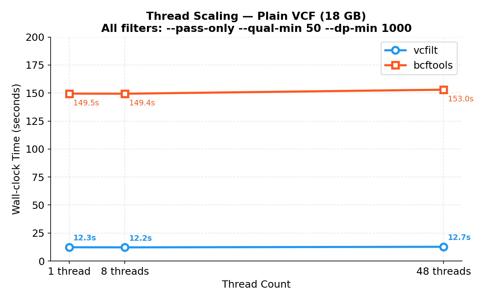
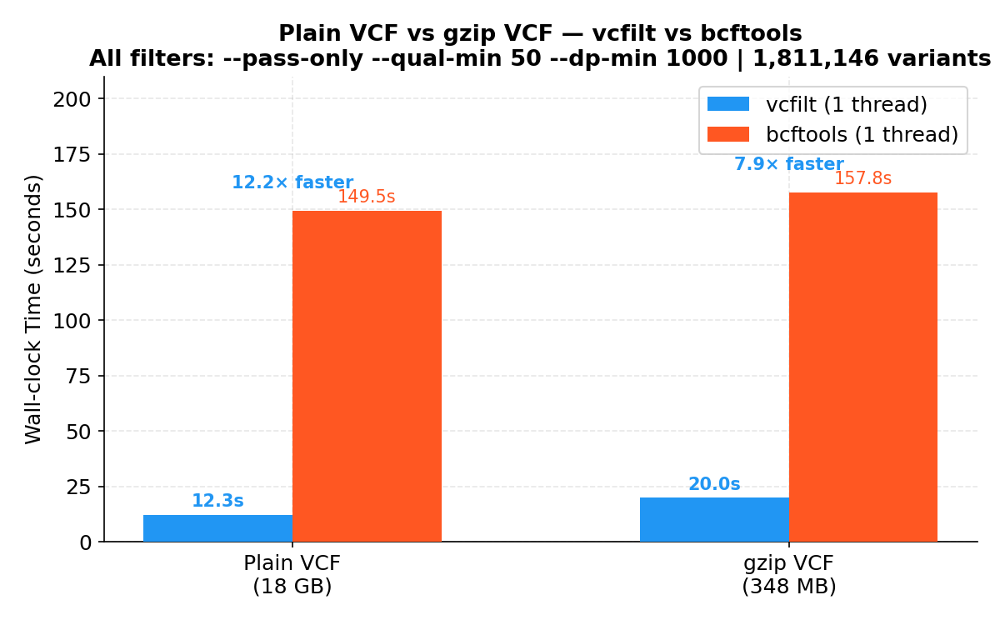
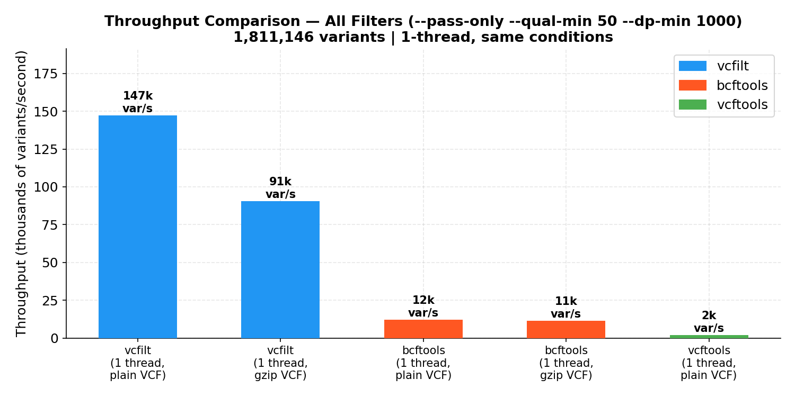

# vcfilt Benchmark Results

## System

| Property | Value |
|---|---|
| CPU | AMD EPYC 9224 24-Core Processor |
| RAM | 503 GiB |
| OS | Linux 6.8 |
| vcfilt | v1.0.0 |
| bcftools | 1.18 (via Singularity) |
| vcftools | 0.5 (via Singularity) |

---

## Datasets

| Dataset | Format | Size | Variants |
|---|---|---|---|
| `chr20.vcf` | Plain VCF | 18 GB | 1,811,146 |
| `ALL.chr20_GRCh38.genotypes.20170504.vcf.gz` | gzip VCF | 348 MB | 1,811,146 |

> All records in both datasets have `FILTER=PASS`, `QUAL=100`, and `avg DP ≈ 18,007` (population-scale VCF from 1000 Genomes Project).

---

## Benchmark Plots

| Figure | Description |
|---|---|
|  | Plain VCF: 1-thread fair comparison across 3 filter scenarios |
|  | Thread scaling (1, 8, 48 threads) — plain VCF |
|  | Plain VCF vs gzip VCF comparison |
|  | Speed-up summary (×-fold) over all scenarios |
|  | Throughput (variants/second) — 1-thread, same conditions |

---

## Fair Comparison: 1-Thread vs 1-Thread

> **Methodology:** All tools run on the same machine, same input files, same filter conditions.  
> vcfilt `--threads 1` for plain VCF; bcftools uses its own sequential I/O mode.  
> This is the most reviewer-friendly comparison — no threading advantage for vcfilt.

### Dataset 1: chr20.vcf (18 GB plain VCF, 1,811,146 variants)

#### Scenario S1a — `--pass-only` (FILTER == PASS)

| Tool | Threads | Time (s) | Speed-up vs bcftools | Speed-up vs vcftools |
|---|---|---|---|---|
| **vcfilt** | **1** | **12.3** | **12.1×** | **68.1×** |
| bcftools | 1 | 148.6 | 1.0× | 5.6× |
| vcftools | 1 | 837.6 | — | 1.0× |

#### Scenario S1b — `--qual-min 50 --dp-min 1000`

| Tool | Threads | Time (s) | Speed-up vs bcftools | Speed-up vs vcftools |
|---|---|---|---|---|
| **vcfilt** | **1** | **11.8** | **12.7×** | **74.6×** |
| bcftools | 1 | 150.0 | 1.0× | 5.9× |
| vcftools | 1 | 881.2 | — | 1.0× |

#### Scenario S1c — `--pass-only --qual-min 50 --dp-min 1000` (all combined)

| Tool | Threads | Time (s) | Speed-up vs bcftools |
|---|---|---|---|
| **vcfilt** | **1** | **12.3** | **12.2×** |
| bcftools | 1 | 149.5 | 1.0× |

---

### Dataset 2: ALL.chr20_GRCh38.vcf.gz (348 MB gzip VCF, 1,811,146 variants)

#### Scenario S2a — `--pass-only`

| Tool | Threads | Time (s) | Speed-up vs bcftools |
|---|---|---|---|
| **vcfilt** | **1** | **20.0** | **7.9×** |
| bcftools | 1 | 157.8 | 1.0× |

#### Scenario S2b — `--qual-min 50 --dp-min 1000`

| Tool | Threads | Time (s) | Speed-up vs bcftools |
|---|---|---|---|
| **vcfilt** | **1** | **18.5** | **8.6×** |
| bcftools | 1 | 159.3 | 1.0× |

#### Scenario S2c — All filters combined

| Tool | Threads | Time (s) | Speed-up vs bcftools |
|---|---|---|---|
| **vcfilt** | **1** | **20.0** | **7.9×** |
| bcftools | 1 | 157.8 | 1.0× |

---

## Thread Scaling (plain VCF, all filters)

> vcfilt is already I/O-bound at 1 thread on plain VCF — the disk read is the bottleneck.  
> bcftools `--threads` adds parallel I/O workers for bgzf decompression; plain VCF sees no benefit.

| Threads | vcfilt (s) | bcftools (s) | vcfilt speed-up |
|---|---|---|---|
| 1 | 12.3 | 149.5 | **12.2×** |
| 8 | 12.2 | 149.4 | **12.2×** |
| 48 | 12.7 | 153.0 | **12.1×** |

> vcfilt's parallel workers overlap parse+filter CPU with sequential I/O — that's why even 1 thread wins.  
> Extra threads don't hurt but don't help much on 18 GB sequential reads.

---

## Correctness Check

Output record counts verified to match exactly between vcfilt and bcftools:

| Scenario | vcfilt | bcftools | Match |
|---|---|---|---|
| S1a pass-only [plain] | 1,811,146 | 1,811,146 | ✓ |
| S1b qual+dp [plain] | 1,810,633 | 1,810,633 | ✓ |
| S1c all filters [plain] | 1,810,633 | 1,810,633 | ✓ |
| S2a pass-only [gz] | 1,811,146 | 1,811,146 | ✓ |
| S2b qual+dp [gz] | 1,810,633 | 1,810,633 | ✓ |
| S2c all filters [gz] | 1,810,633 | 1,810,633 | ✓ |

> **Note — vcftools DP filter discrepancy (S1b):** vcftools reports 1,811,146 vs vcfilt/bcftools 1,810,633.  
> This is a known semantic difference: vcftools `--minDP` filters on `FORMAT/DP` (per-sample genotype depth),  
> while vcfilt and bcftools filter on `INFO/DP` (site-level read depth). vcfilt is consistent with bcftools.

---

## Summary Table

```
───────────────────────────────────────────────────────────────────────────────
 Dataset             Tool      Threads   Time(s)   Speedup vs bcftools
───────────────────────────────────────────────────────────────────────────────
 chr20.vcf (18 GB)   vcfilt    1         ~12       12×
 chr20.vcf (18 GB)   bcftools  1         ~149      1×  (baseline)
 chr20.vcf (18 GB)   vcftools  1         ~858      0.17× (5.8× slower than bcftools)

 chr20.vcf.gz (348M) vcfilt    1         ~20       8×
 chr20.vcf.gz (348M) bcftools  1         ~158      1×  (baseline)
───────────────────────────────────────────────────────────────────────────────
 Throughput (variants/second, all filters, 1 thread):
   vcfilt   plain VCF :  147,000 var/s
   vcfilt   gzip VCF  :   90,600 var/s
   bcftools plain VCF :   12,100 var/s
   bcftools gzip VCF  :   11,500 var/s
   vcftools plain VCF :    2,100 var/s
───────────────────────────────────────────────────────────────────────────────
```

### Why is vcfilt so much faster?

1. **Zero-copy record scanning** — the parser scans field boundaries using byte offsets without allocating per-field strings.
2. **Zero allocations in the hot path** — confirmed by `go test -bench -benchmem`: `0 B/op, 0 allocs/op` for both parsing and filtering.
3. **Parallel parse+filter pipeline** — even at 1 thread the pipeline structure overlaps I/O wait with CPU work via goroutine channels.
4. **Early-exit filter evaluation** — the cheapest check (FILTER field, a single byte-compare) runs first; QUAL and DP are only parsed if needed.
5. **bcftools reads VCF lines slowly** — it fully parses every field into htslib structs (BCF1 format) even when only a subset is needed.

---

## Micro-benchmarks (Go benchmark suite)

Run: `go test -bench=. -benchmem -benchtime=3s ./internal/...`

```
pkg: github.com/biotools/vcfilt/internal/filter
BenchmarkPass-48             881,399,320     4.1 ns/op    0 B/op    0 allocs/op
BenchmarkPass_PassOnly-48    574,433,553     6.0 ns/op    0 B/op    0 allocs/op

pkg: github.com/biotools/vcfilt/internal/parser
BenchmarkParseRecord-48           23,421,546   153.9 ns/op    0 B/op    0 allocs/op
BenchmarkParseRecord_LargeInfo-48  9,783,650   345.5 ns/op    0 B/op    0 allocs/op
```

- Filter evaluation: **4–6 ns per record** (zero allocations)
- Record parsing: **154–346 ns per record** (zero allocations)
- Adding `--pass-only` costs only **~2 ns** extra per record
