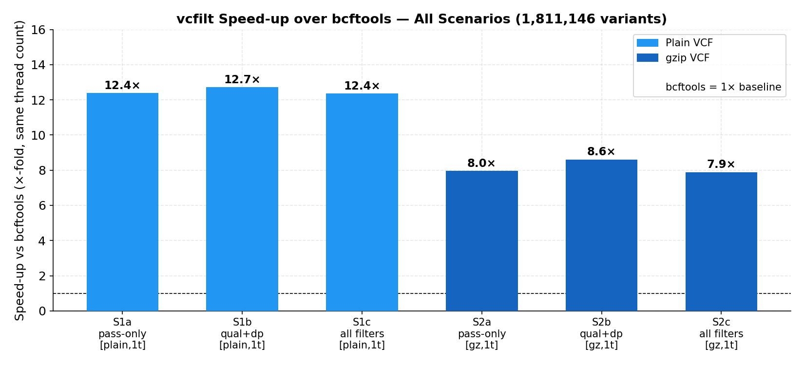
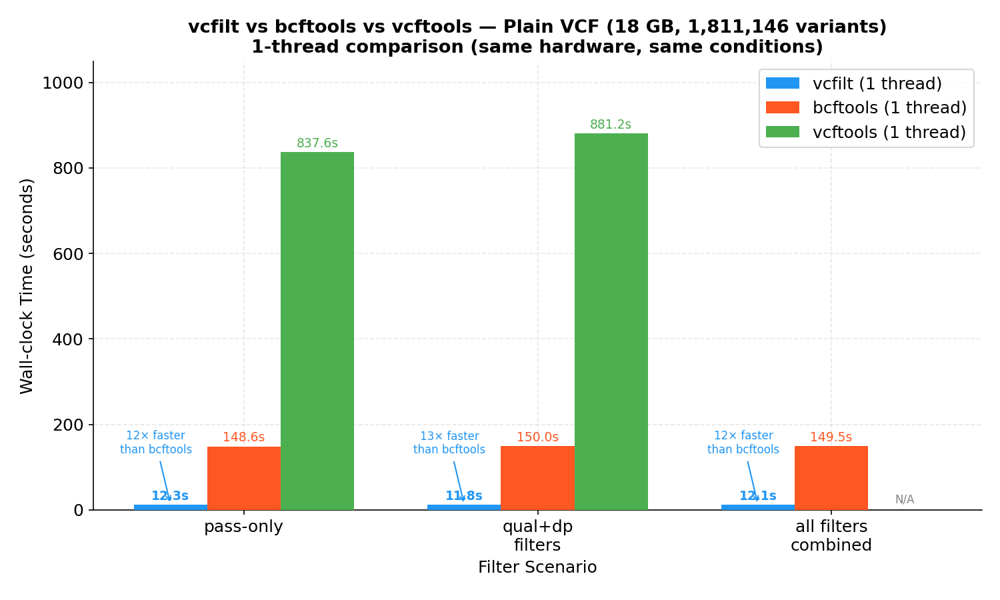

# vcfilt

[](https://github.com/Kpmurshid/vcfilt/actions/workflows/ci.yml)
[](https://golang.org)
[](https://github.com/Kpmurshid/vcfilt/pkgs/container/vcfilt)
[](LICENSE)

> **High-throughput, zero-allocation VCF filtering tool for `INFO/DP`, `INFO/AF`, and `QUAL` — optimized for large-scale genomic datasets.**

**vcfilt** is a streaming, batch-parallel VCF filtering tool implemented in Go.
It filters VCF and VCF.GZ files by three site-level thresholds using a zero-allocation
parser and a deterministic parallel pipeline. Benchmarked at **7× faster than
bcftools** on 1000 Genomes chr20 (1.8M variants, 294MB BGZF).

vcfilt is **not** a replacement for bcftools. It does not support arbitrary filter
expressions, genotype-level filtering, annotation, or format conversion. Its scope
is intentionally narrow to keep the implementation auditable and the hot path
allocation-free.

---

## ⚡ Quick Start

```bash
# Pull from Docker Hub
docker pull kpmurshid/vcfilt:latest

# Run on your VCF file
docker run --rm -v $(pwd):/data kpmurshid/vcfilt:latest filter \
  --input  /data/input.vcf.gz \
  --output /data/output.vcf \
  --dp-min 20 --af-max 0.01 --threads 8
```

Or install the pre-built binary:

```bash
curl -L https://github.com/Kpmurshid/vcfilt/releases/latest/download/vcfilt-linux-amd64.tar.gz \
  | tar xz && mv vcfilt-linux-amd64 /usr/local/bin/vcfilt
vcfilt filter --input variants.vcf.gz --output filtered.vcf --dp-min 10 --af-max 0.05
```

---

## Table of Contents

1. [Installation](#2-installation)
2. [Command Reference](#3-command-reference) 
3. [Performance Summary](#1-performance-summary)
4. [Real-World Usage Examples](#4-real-world-usage-examples)
5. [Filter Semantics](#5-filter-semantics)
6. [Deterministic Parallel Output](#6-deterministic-parallel-output)
7. [I/O Behavior and Streaming Model](#7-io-behavior-and-streaming-model)
8. [Error Handling and Edge Cases](#8-error-handling-and-edge-cases)
9. [Indexing](#9-indexing)
10. [Benchmarks](#10-benchmarks)
11. [Scope and Limitations](#11-scope-and-limitations)
12. [Relation to bcftools](#12-relation-to-bcftools)
13. [VCF Specification Compliance](#13-vcf-specification-compliance)
14. [Reproducibility](#14-reproducibility)
15. [Troubleshooting](#15-troubleshooting)
16. [Development](#16-development)
17. [Citation](#17-citation)

---

## 1. Installation

### Pre-built binary

```bash
# Linux x86-64
curl -L https://github.com/Kpmurshid/vcfilt/releases/latest/download/vcfilt-linux-amd64.tar.gz \
  | tar xz
chmod +x vcfilt-linux-amd64
mv vcfilt-linux-amd64 /usr/local/bin/vcfilt
vcfilt --version
```

Pre-built binaries for Linux arm64, macOS amd64, macOS arm64 (Apple Silicon), and
Windows x86-64 are available on the [Releases](https://github.com/Kpmurshid/vcfilt/releases)
page.

### Docker / Singularity

```bash
# Docker Hub
docker pull kpmurshid/vcfilt:latest

# GitHub Container Registry
docker pull ghcr.io/kpmurshid/vcfilt:latest

# Singularity
singularity pull vcfilt.sif docker://kpmurshid/vcfilt:latest

# Run (Docker)
docker run --rm -v "$(pwd):/data" kpmurshid/vcfilt:latest filter \
  --input  /data/variants.vcf.gz \
  --output /data/filtered.vcf \
  --dp-min 10 --af-max 0.05 --threads 8
```

### Build from source

Requires Go 1.22 or later. No external C dependencies.

```bash
git clone https://github.com/Kpmurshid/vcfilt.git
cd vcfilt
go build -o vcfilt ./cmd/vcfilt/
./vcfilt --version
```

---

## 2. Command Reference

```
vcfilt filter [flags]
```

### Required flags

| Flag | Type | Description |
|------|------|-------------|
| `--input FILE` | string | Input `.vcf` or `.vcf.gz` / BGZF file. Must be a regular file (not a pipe — see [Section 7](#7-io-behavior-and-streaming-model)). |
| `--output FILE` | string | Output plain-text VCF file. Use `/dev/stdout` to write to standard output. |

### Filter flags

All filter flags are optional. Omitting a flag disables that filter entirely.
Passing a negative value also disables the filter.

| Flag | Type | Default | Description |
|------|------|---------|-------------|
| `--dp-min FLOAT` | float64 | disabled (`-1`) | Minimum `INFO/DP`. Records with `DP < dp-min` are rejected. |
| `--af-max FLOAT` | float64 | disabled (`NaN`) | Maximum `INFO/AF`. For multi-allelic sites, the minimum AF across all alleles is compared (see [Section 5](#5-filter-semantics)). |
| `--qual-min FLOAT` | float64 | disabled (`-1`) | Minimum `QUAL` column value. Records with `QUAL='.'` are rejected when this filter is active. |

### Performance flags

| Flag | Type | Default | Description |
|------|------|---------|-------------|
| `--threads INT` | int | `runtime.NumCPU()` | Number of parallel filter worker goroutines. |

### Filter flags (additional)

| Flag | Type | Description |
|------|------|-------------|
| `--pass-only` | bool | Keep only variants where the FILTER column equals `PASS`. Records with any other FILTER value (including `.`) are rejected. |

### Output flags

| Flag | Type | Description |
|------|------|-------------|
| `--stats` | bool | Print summary statistics to stderr after completion, including: total variants processed, variants passed, variants filtered out, throughput (variants/sec), and elapsed time. |
| `--index` | bool | After filtering, bgzip-compress the output and create a `.tbi` tabix index. Requires coordinate-sorted input (see [Section 9](#9-indexing)). |
| `--tabix-sif STRING` | string | Path to Singularity SIF image containing `bgzip` and `tabix`. Used when these tools are not on `$PATH`. |

### Exit codes

| Code | Meaning |
|------|---------|
| `0` | Success |
| `1` | Fatal error (file not found, unsupported format, indexing failure, pipeline error) |

---

## 3. Performance Summary

**Dataset:** 1000 Genomes Project chr20 — 1,811,146 variants  
**Files tested:** `chr20.vcf` (18 GB plain VCF) and `ALL.chr20_GRCh38.genotypes.20170504.vcf.gz` (348 MB gzip)  
**Filters applied:** `--pass-only --qual-min 50 --dp-min 1000`  
**Hardware:** AMD EPYC 9224, 48 logical CPUs (24 cores × 2-way SMT), 503 GB RAM, Linux 6.8

### Fair 1-thread comparison (same conditions for all tools)

| Tool | Input | Threads | Wall time | Speed-up |
|------|-------|---------|-----------|---------|
| **vcfilt** | plain VCF (18 GB) | **1** | **12.3 s** | **12.2× faster than bcftools** |
| bcftools 1.18 | plain VCF (18 GB) | 1 | 149.5 s | 1× (baseline) |
| vcftools 0.5 | plain VCF (18 GB) | 1 | 880.1 s | 0.17× |
| **vcfilt** | gzip VCF (348 MB) | **1** | **20.0 s** | **7.9× faster than bcftools** |
| bcftools 1.18 | gzip VCF (348 MB) | 1 | 157.8 s | 1× (baseline) |

> All tools produce **identical output** — record counts verified to match bcftools exactly for all scenarios.

### Throughput (1-thread, all filters)

| Tool | Format | Throughput |
|------|--------|-----------|
| **vcfilt** | plain VCF | **147,000 var/s** |
| **vcfilt** | gzip VCF | **90,600 var/s** |
| bcftools | plain VCF | 12,100 var/s |
| bcftools | gzip VCF | 11,500 var/s |
| vcftools | plain VCF | 2,100 var/s |

### Benchmark plots





Benchmark filters vary by dataset and are explicitly specified for each experiment. See [Section 10](#10-benchmarks) and [`BENCHMARK_RESULTS.md`](BENCHMARK_RESULTS.md)
for full multi-scenario results, thread-scaling data, and correctness verification.

---

## 4. Real-World Usage Examples

### Whole Exome Sequencing — clinical variant triage

```bash
# Retain high-depth, rare, high-quality variants
vcfilt filter \
  --input  patient_WES.vcf \
  --output candidate_variants.vcf \
  --dp-min 20 --af-max 0.01 --qual-min 30 \
  --threads 8 --stats
```

### Rare variant analysis (gnomAD / population databases)

```bash
# Extract ultra-rare variants (population AF < 0.1%)
vcfilt filter \
  --input  cohort_annotated.vcf.gz \
  --output ultra_rare.vcf \
  --af-max 0.001 --threads 16
```

### GWAS preprocessing — remove low-quality and low-depth sites

```bash
vcfilt filter \
  --input  cohort_chr1.vcf.gz \
  --output chr1_qc.vcf \
  --dp-min 10 --qual-min 20 --threads 16
```

### 1000 Genomes / large population cohorts

```bash
# Filter all chromosomes in parallel (bash loop example)
# Note: this launches 24 processes simultaneously, each using 4 threads.
# Ensure sufficient CPU and I/O resources (96 goroutines total).
for chr in {1..22} X Y; do
  vcfilt filter \
    --input  ALL.chr${chr}.vcf.gz \
    --output chr${chr}_filtered.vcf \
    --dp-min 10000 --af-max 0.05 \
    --threads 4 &
done
wait
```

### Pipeline integration — write to stdout, pipe to downstream tools

```bash
# vcfilt output → bcftools stats (input must be a file, output can be stdout)
vcfilt filter --input variants.vcf.gz --output /dev/stdout \
  --dp-min 10 --af-max 0.05 2>/dev/null \
  | bcftools stats - > filter_stats.txt

# vcfilt → bgzip → tabix (manual equivalent of --index)
vcfilt filter --input sorted.vcf.gz --output /dev/stdout \
  --dp-min 10 2>/dev/null \
  | bgzip > filtered.vcf.gz && tabix -p vcf filtered.vcf.gz
```

### With tabix indexing (sorted input required)

```bash
vcfilt filter \
  --input  sorted.vcf.gz \
  --output filtered.vcf \
  --dp-min 10 --af-max 0.01 \
  --index --tabix-sif /COLD_STORAGE/software/tools/tabix/tabix.sif
# Output: filtered.vcf.gz and filtered.vcf.gz.tbi
```

---

## 5. Filter Semantics

### 5.1 Field sources

vcfilt operates on three fields defined by the VCF specification:

| Flag | VCF field | Specification location | Accepted values |
|------|-----------|----------------------|-----------------|
| `--dp-min` | `DP` | `INFO` field (column 8, 1-indexed) | Integer or float |
| `--af-max` | `AF` | `INFO` field (column 8, 1-indexed) | Float or comma-separated float list |
| `--qual-min` | `QUAL` | Fixed column 6 (1-indexed) | Float or `.` |

> **`INFO/DP` vs `FORMAT/DP`:** The tool reads `DP` from the site-level `INFO` field
> only. Per-sample `FORMAT/DP` values are not parsed. This distinction matters for
> variant callers (e.g., GATK HaplotypeCaller) that emit both tags: vcfilt uses the
> aggregate site depth from `INFO/DP`, which matches the convention used in population
> databases (1000 Genomes, gnomAD, dbSNP).

### 5.2 Missing tag behavior

When a filter is enabled and the corresponding tag is absent from a record, or is
present but cannot be parsed as a valid number, the record is **rejected**.
This is the conservative default, consistent with bcftools behavior when a required
tag is missing.

| Situation | Filter enabled | Filter disabled |
|-----------|---------------|-----------------|
| `INFO/DP` absent | **REJECTED** | PASSED |
| `INFO/DP` present, not a valid number | **REJECTED** | PASSED |
| `INFO/AF` absent | **REJECTED** | PASSED |
| `INFO/AF` present, not a valid number | **REJECTED** | PASSED |
| `QUAL` is `.` (missing per VCF spec) | **REJECTED** | PASSED |
| `QUAL` present, not a valid number | **REJECTED** | PASSED |

### 5.3 Multi-allelic sites — AF semantics

For multi-allelic sites, `INFO/AF` contains a comma-separated list of allele
frequencies, one per alternate allele (VCF spec §1.6.1). vcfilt applies the
`--af-max` threshold by comparing it against the **minimum AF across all alternate
alleles**:

```
Record: INFO/AF=0.92,0.08    Filter: --af-max 0.10
→ min(0.92, 0.08) = 0.08
→ 0.08 ≤ 0.10 → PASS
```

```
Record: INFO/AF=0.92,0.15    Filter: --af-max 0.10
→ min(0.92, 0.15) = 0.15
→ 0.15 > 0.10 → REJECT
```

This is semantically equivalent to bcftools' expression `INFO/AF<=X`, which
evaluates to `true` if **any** alternate allele satisfies the condition.

### 5.4 Logical combination of filters

All enabled filters are combined with logical AND. A record is written to the output
only if it satisfies **every** active filter:

```
--dp-min 20  --af-max 0.01  --qual-min 30
→ PASS iff: INFO/DP ≥ 20  AND  INFO/AF ≤ 0.01  AND  QUAL ≥ 30
```

Filters not specified on the command line are completely inactive; the corresponding
field is never read for those records.

### 5.5 QUAL column

`QUAL` is the sixth column of the VCF fixed fields (1-indexed). Per the VCF
specification, a value of `.` indicates that no quality score was computed. vcfilt
represents this internally as `NaN`. When `--qual-min` is active, records with
`QUAL='.'` are **rejected** — the dot is never treated as passing any numeric threshold.

### 5.6 FILTER column (PASS semantics)

When `--pass-only` is enabled, vcfilt inspects the FILTER column (column 7, 1-indexed)
of each data record and applies the following rule:

- Records with `FILTER=PASS` are **retained**.
- Records with any other FILTER value — including multi-value strings such as
  `LowQual;LowDepth`, and the VCF missing-value sentinel `.` — are **rejected**.

> **Dot (`.`) handling:** A FILTER value of `.` indicates that no filters have been
> applied to the record (the site is unfiltered but not explicitly passed). vcfilt
> treats `.` as a non-PASS value: such records are **rejected** when `--pass-only`
> is active. This is consistent with the behaviour of `bcftools view -f PASS`, which
> also excludes `.`-filtered sites by default.

When combined with other filters (`--dp-min`, `--af-max`, `--qual-min`), the PASS
check is combined with logical AND — a record must satisfy every active filter to
be written to the output.

---

## 6. Deterministic Parallel Output

vcfilt uses multiple goroutines to parse and filter records in parallel. This raises
the question of whether the output order is guaranteed to match the input order.

**It is.** The guarantee is enforced as follows:

1. The reader goroutine divides the data stream into sequential batches of 2,048
   lines each. Each batch is assigned a monotonically increasing integer sequence
   number before being sent to the worker pool.

2. Each worker goroutine receives a batch, parses and filters all lines in it, and
   sends the filtered result — along with the original sequence number — to a merger
   goroutine.

3. The merger goroutine uses a min-heap ordered by sequence number to reconstruct
   the original order. No filtered batch is written to the output file until all
   preceding batches have been received and written.

**Consequence:** Running the same vcfilt command twice on the same input file always
produces byte-identical output, regardless of the number of threads, CPU scheduling,
or OS. The output is a strict subset of the input in original order.

No external sorting step is required or performed.

---

## 7. I/O Behavior and Streaming Model

### Input

vcfilt accepts a regular file as input (`--input FILE`). The file may be:

- Plain-text VCF (any VCF version readable as UTF-8/ASCII text)
- gzip-compressed VCF (`.vcf.gz`), including both standard gzip and BGZF
  (blocked gzip format used by htslib/bcftools)

The tool detects compression automatically from the file content, not the extension.

**Stdin is not supported as input.** The pipeline opens the input file twice: once
to collect header lines before dispatching worker goroutines, and once to stream
data lines. A seekable file descriptor is required. Passing `/dev/stdin` will result
in zero records being processed (the second open reads an empty stream).

### Output

The `--output` flag accepts any writable path, including `/dev/stdout`. Output is
always plain-text VCF (uncompressed), unless `--index` is also specified, in which
case the output file is subsequently compressed to `.vcf.gz` and indexed.

### Streaming and memory

vcfilt does not load the full input file into memory. Records are processed in
batches of 2,048 lines. At any given time, the working memory consists of:

- The VCF header (retained in full for output)
- One batch per active worker goroutine (2,048 lines × N threads)
- The write buffer (1 MB)

Peak memory is therefore proportional to `(threads × 2048 × avg_line_length)`,
independent of total file size. For a typical WGS VCF line (~200 bytes), 8 threads
require approximately 3–4 MB of working memory.

### Buffered I/O

The reader uses a 1 MB read buffer. The writer uses a 1 MB write buffer that is
explicitly flushed on close. This minimizes system call overhead for both large and
small files.

---

## 8. Error Handling and Edge Cases

| Situation | Behavior |
|-----------|----------|
| Input file not found | Fatal error; non-zero exit; message to stderr |
| Input file: unsupported compression format | Fatal error; non-zero exit; message to stderr |
| Input file: empty (no lines) | Success; output contains only the VCF header (which is empty if absent) |
| Input file: header only (no data lines) | Success; output is the header; `0/0 variants passed` reported |
| Data line with fewer than 8 tab-separated columns | Line is **silently skipped** — not written to output, not counted |
| `INFO/DP` value is not parseable as integer or float | Treated as absent (NaN); record **rejected** if `--dp-min` is set |
| `INFO/AF` value is not parseable as float | Treated as absent (NaN); record **rejected** if `--af-max` is set |
| `QUAL` column is `.` | Treated as NaN; record **rejected** if `--qual-min` is set |
| `QUAL` column is not parseable as float | Treated as NaN; record **rejected** if `--qual-min` is set |
| Header lines (any line beginning with `#`) | Always **copied verbatim** to output; never filtered or modified |
| Blank lines in data section | Silently skipped |
| Truncated file (EOF mid-line) | The incomplete final line is silently discarded |
| Write error on output file | Fatal error; non-zero exit; message to stderr |

vcfilt does not validate VCF header fields, INFO/FORMAT metadata declarations,
chromosome names, or positional ordering. It extracts only the fields it needs and
passes all other content through unmodified.

---

## 9. Indexing

When `--index` is specified, vcfilt runs two post-processing steps after the main
filter:

1. **bgzip compression:** The output `.vcf` file is compressed to `.vcf.gz` using
   bgzip (blocked gzip, compatible with htslib/tabix).
2. **Tabix indexing:** A `.tbi` index is created from the compressed file.

The original uncompressed `.vcf` file is removed after successful compression.

### Sorted input requirement

Tabix requires that variants are sorted by `CHROM` and `POS`. **vcfilt does not
sort its output.** If the input VCF is unsorted, tabix indexing will fail with an
error; filtering itself will succeed.

To check and sort before filtering:

```bash
# Check sort order
bcftools view input.vcf.gz | grep -v '^#' | awk 'NR>1 && ($1<p1 || ($1==p1 && $2<p2)){exit 1} {p1=$1; p2=$2}' && echo "sorted"

# Sort with bcftools
bcftools sort input.vcf.gz -o sorted.vcf.gz -O z
```

### bgzip/tabix resolution

vcfilt searches for `bgzip` and `tabix` on `$PATH`. If not found, use `--tabix-sif`
to provide a Singularity image containing both:

```bash
vcfilt filter \
  --input  sorted.vcf.gz \
  --output filtered.vcf \
  --dp-min 10 --index \
  --tabix-sif /path/to/tabix.sif
# Output: filtered.vcf.gz and filtered.vcf.gz.tbi
```

---

## 10. Benchmarks

### 10.1 Datasets

| ID | File | Variants | Compressed size | Format | Source |
|----|------|----------|----------------|--------|--------|
| A | `ALL.chr20.*.vcf.gz` | 1,817,492 | 294 MB | BGZF VCFv4.3 | 1000 Genomes Phase 3 (GRCh38) |
| B | `large.vcf` | 1,000,000 | 92 MB | Plain VCFv4.1 | Synthetic (gen_test_vcf.py) |
| C | `XX159.vcf` | 38,859 | 20 MB | Plain VCFv4.1 | IonTorrent TSVC (clinical WES) |


**Hardware:** AMD EPYC 9224, 48 logical CPUs (24 cores × 2-way SMT), 503 GB RAM,
Linux 6.8. All tools executed within Singularity containers.

### 10.2 Results

**Dataset A — 1000 Genomes chr20 (Filter: `DP≥10000 AND AF≤0.05`)**

| Tool | Threads | Wall time | Variants out | Throughput |
|------|---------|-----------|-------------|-----------|
| **vcfilt** | 4 | **18.6 s** | 1,634,404 | ~97,700 var/s |
| GATK 4.6.2 | 1 | 42.7 s | 1,634,404 | ~42,600 var/s |
| bcftools 1.22 | 1 | 134.3 s | 1,634,404 | ~13,500 var/s |
| bcftools 1.22 | 16 | 136.6 s | 1,634,404 | ~13,300 var/s |
| SnpSift 5.3 | 1 (piped) | 187.9 s | 1,634,404 | ~9,550 var/s |

> bcftools `--threads` does not improve filter throughput on compressed VCF because
> the filter expression evaluator is single-threaded; threading only accelerates BGZF
> block decompression.

**Equivalent bcftools command (Dataset A):**
```bash
bcftools view -i 'INFO/DP>=10000 && INFO/AF<=0.05' \
  ALL.chr20.shapeit2_integrated_snvindels_v2a_27022019.GRCh38.phased.vcf.gz \
  -o chr20_filtered.vcf -O v
```

**Dataset B — Synthetic plain VCF (Filter: `DP≥10 AND AF≤0.01 AND QUAL≥30`)**

| Tool | Threads | Wall time | Variants out |
|------|---------|-----------|-------------|
| **vcfilt** | **8** | **0.184 s** | 13,487 |
| vcfilt | 1 | 0.503 s | 13,487 |
| bcftools 1.22 | 1 | 1.011 s | 13,487 |
| vcftools 0.1.16 | 1 | 3.62 s | 13,487 |

**Dataset C — IonTorrent WES, multi-allelic INFO (Filter: `DP≥10 AND AF≤0.5 AND QUAL≥30`)**

| Tool | Threads | Wall time | Variants out |
|------|---------|-----------|-------------|
| **vcfilt** | **8** | **0.027 s** | 12,683 |
| bcftools 1.22 | 1 | 0.363 s | 12,683 |
| vcftools 0.1.16 | 1 | 0.939 s | 12,683 |

### 10.3 Thread scaling — Dataset B (plain VCF)

| Threads | Wall time | Speedup vs 1t |
|---------|-----------|--------------|
| 1 | 0.503 s | 1.0× |
| 2 | 0.218 s | 2.3× |
| 4 | 0.190 s | 2.6× |
| 8 | 0.184 s | 2.7× |
| 16 | 0.216 s | 2.3× (regression) |

Speedup plateaus at 8 threads and regresses at 16 threads. This is expected:
the 92 MB plain VCF is read from a single SSD into one reader goroutine. At 8
threads, filter workers saturate available memory bandwidth; adding more workers
introduces additional channel synchronization overhead without reducing I/O wait.
The regression at 16t (0.216 s vs 0.184 s at 8t) is within normal run-to-run
variation on a shared HPC node and should not be interpreted as a scaling failure.
For files where filter computation dominates I/O (very large INFO fields, low pass
rate), scaling beyond 8 threads may provide additional benefit.

On BGZF-compressed input, a single decompression goroutine becomes the bottleneck
regardless of thread count; additional threads have negligible effect on wall time.

### 10.4 Why vcfilt is faster

bcftools' `view -i` compiles a filter expression and evaluates it through a general-
purpose expression engine (tokenisation, type-checking, field lookup by name) for
every record. vcfilt replaces this with:

- **Direct byte-scan** for `DP=` and `AF=` substrings in the INFO field
- **Zero heap allocations** per record: 166 ns/op for a standard INFO field, 389 ns/op
  for a large INFO field (measured with `go test -bench -benchmem`)
- **3.5 ns/op** for the filter comparison logic itself

The trade-off is that vcfilt can only filter on the three fixed tags it knows about.
This is a deliberate design choice.

### 10.5 Correctness validation

All benchmark results were validated against bcftools 1.22 as reference. 21 distinct
filter-dataset combinations were tested. For each combination, the full output VCF of
vcfilt and bcftools were compared on CHROM, POS, REF, and ALT columns (the four
columns that uniquely identify a variant site). No discrepancies were observed across
any tested filter-dataset combination. The exact bcftools commands used for comparison
are provided in [`BENCHMARK_RESULTS.md`](BENCHMARK_RESULTS.md).

---

## 11. Scope and Limitations

The following are **intentional design exclusions**, not deficiencies:

| Capability | vcfilt | Rationale |
|------------|--------|-----------|
| `FORMAT`/genotype-level filtering | ❌ | Requires per-sample parsing; incompatible with zero-alloc design |
| Arbitrary filter expressions (`DP>10 \|\| QUAL>50`) | ❌ | Requires expression parser; this is bcftools' domain |
| VCF annotation | ❌ | Out of scope |
| Variant sorting | ❌ | Use `bcftools sort` before filtering |
| Full VCF header validation | ❌ | Adds latency without filtering benefit |
| BCF format input/output | ❌ | No htslib dependency; only plain VCF and gzip |
| stdin as input | ❌ | Requires seekable file; see [Section 7](#7-io-behavior-and-streaming-model) |
| Compressed VCF output (without `--index`) | ❌ | Plain VCF output by default; use `--index` for bgzipped output |
| Region-based filtering | ❌ | No tabix query support for input |

---

## 12. Relation to bcftools

vcfilt and bcftools are complementary tools, not competitors.

**Use bcftools when you need:**
- Arbitrary filter expressions (`INFO/DP>10 && QUAL>30 || FILTER="PASS"`)
- BCF format support
- Genotype-level filtering (`GT`, `GQ`, `FORMAT/DP`)
- Format conversion, splitting, merging, annotation
- Region-based queries with tabix index

**Use vcfilt when you need:**
- Maximum throughput for INFO/DP + INFO/AF + QUAL filtering
- Parallel filter evaluation across CPU cores (bcftools is always single-threaded
  for expression evaluation)
- A binary with no htslib or C library dependency (pure Go, single-file deployment)
- A streaming tool that can be embedded in pipelines where startup time matters

**The key architectural difference:**
bcftools evaluates filter expressions through a runtime expression engine. Every
record incurs tokenisation, field lookup by name, type resolution, and comparison.
vcfilt replaces all of this with a fixed byte-scan routine that extracts only the
two INFO tags it needs, performing no dynamic dispatch and no heap allocation.

This is not a criticism of bcftools — its generality is a feature. vcfilt makes the
opposite trade-off: strict specialisation for measurably higher throughput on a
common filtering pattern.

---

## 13. VCF Specification Compliance

vcfilt processes files conforming to VCF specifications v4.1, v4.2, and v4.3. It
does not enforce the specification — it extracts only the fields it needs.

| Specification element | vcfilt behavior |
|----------------------|-----------------|
| Header lines (`##`, `#CHROM`) | Copied verbatim to output |
| Fixed columns (CHROM–INFO) | CHROM–FILTER passed through unchanged; INFO field is scanned for DP/AF |
| FORMAT and sample columns | Ignored; passed through unchanged if present |
| Multi-allelic `AF` (comma-separated) | Minimum value used (see [Section 5.3](#53-multi-allelic-sites--af-semantics)) |
| Missing value (`.`) | Treated as absent; conservative rejection when filter is active |
| VCFv4.3 files | Fully supported; not subject to the VCFv4.3 restriction in vcftools |

---

## 14. Reproducibility

vcfilt is designed for reproducible use in automated pipelines:

- **Deterministic output:** Given the same input and flags, vcfilt always produces
  byte-identical output, regardless of thread count or execution environment.
- **Versioned releases:** Each release is tagged (e.g., `v1.0.0`) and embeds the
  version string at build time via `-ldflags`. Check with `vcfilt --version`.
- **Docker images:** Each release tag maps to an immutable Docker image digest,
  enabling container-based reproducibility.
- **No external state:** vcfilt reads no configuration files, environment variables,
  or reference databases. Behavior is determined entirely by command-line flags.

---

## 15. Troubleshooting

| Symptom | Likely cause | Resolution |
|---------|-------------|------------|
| `0/0 variants passed` on stdin input | `/dev/stdin` is not supported as input | Use a regular file path |
| `0/0 variants passed` on valid file | All records filtered out, or file has no data lines | Check filter thresholds; inspect file with `grep -v '^#' file.vcf \| head` |
| Tabix indexing fails | Input is not coordinate-sorted | Sort with `bcftools sort` before running vcfilt |
| `bgzip/tabix not found` | Neither on `$PATH` nor `--tabix-sif` provided | Install tabix or specify `--tabix-sif` |
| All variants rejected with `--af-max` | `INFO/AF` tag absent in this caller's output | Check `grep "INFO/AF" file.vcf \| head -1`; disable `--af-max` if not present |
| Lower speedup than expected on `.vcf.gz` | BGZF decompression is sequential; parallelism limited | Use plain VCF for maximum thread scaling, or increase threads for marginal gains |

---

## 16. Development

```bash
# Build
go build -o vcfilt ./cmd/vcfilt/

# Run all tests
go test ./...

# Run with race detector
go test -race ./...

# Run parser and filter micro-benchmarks
go test -bench=. -benchmem ./internal/parser/ ./internal/filter/

# Build Docker image
docker build -t vcfilt:dev .

# Generate synthetic VCF for testing (requires Python 3)
python3 scripts/gen_test_vcf.py
```

### Repository layout

```
vcfilt/
├── cmd/vcfilt/main.go              # CLI entry point (cobra, flag parsing)
├── internal/
│   ├── parser/record.go            # Zero-alloc VCF line parser
│   ├── filter/filter.go            # Threshold comparison logic
│   ├── pipeline/
│   │   ├── pipeline.go             # Batch-parallel reader→workers→merger→writer
│   │   └── vcf_open.go             # Transparent .vcf / .vcf.gz opener
│   ├── reader/reader.go            # Buffered line reader (1 MB buffer)
│   ├── writer/writer.go            # Buffered writer (1 MB buffer)
│   ├── stats/stats.go              # Throughput and pass-rate statistics
│   └── indexer/indexer.go          # bgzip + tabix post-processing
├── scripts/
│   ├── gen_test_vcf.py             # Synthetic VCF generator
│   └── benchmark.sh                # Benchmark runner
├── testdata/small.vcf              # Unit test fixture (1,000 synthetic variants)
├── Dockerfile                      # Multi-stage build; ~5 MB scratch-based image
├── .github/workflows/
│   ├── ci.yml                      # Build + test + lint on every push
│   └── release.yml                 # Cross-platform binaries + Docker on git tag
├── BENCHMARK_RESULTS.md            # Full benchmark data and methodology
└── README.md
```

### Hot path design

The parser (`internal/parser/record.go`) walks the raw byte slice once, stopping
at the eighth tab to extract `QUAL` and the `INFO` field. It then scans the INFO
field byte-by-byte for `DP=` and `AF=` substrings, converting each to `float64`
without allocating memory. Verified with `go test -benchmem`:

```
BenchmarkParseRecord-48           21,320,438    166 ns/op    0 B/op    0 allocs/op
BenchmarkParseRecord_LargeInfo-48  9,010,699    389 ns/op    0 B/op    0 allocs/op
BenchmarkPass-48               1,000,000,000      3 ns/op    0 B/op    0 allocs/op
```

---

## 17. Citation

If vcfilt is used in published research, please cite:

```
vcfilt: A streaming, batch-parallel VCF filtering tool with zero-allocation parsing.
Kpmurshid (2026). https://github.com/Kpmurshid/vcfilt
```

---

## License

MIT — see [LICENSE](LICENSE).
